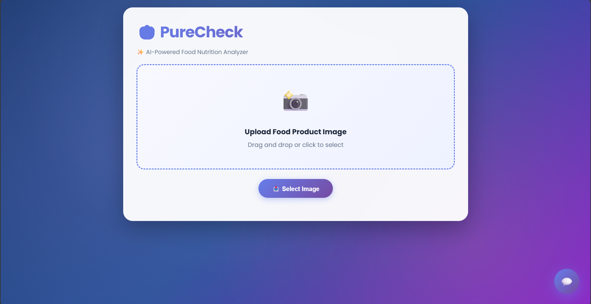
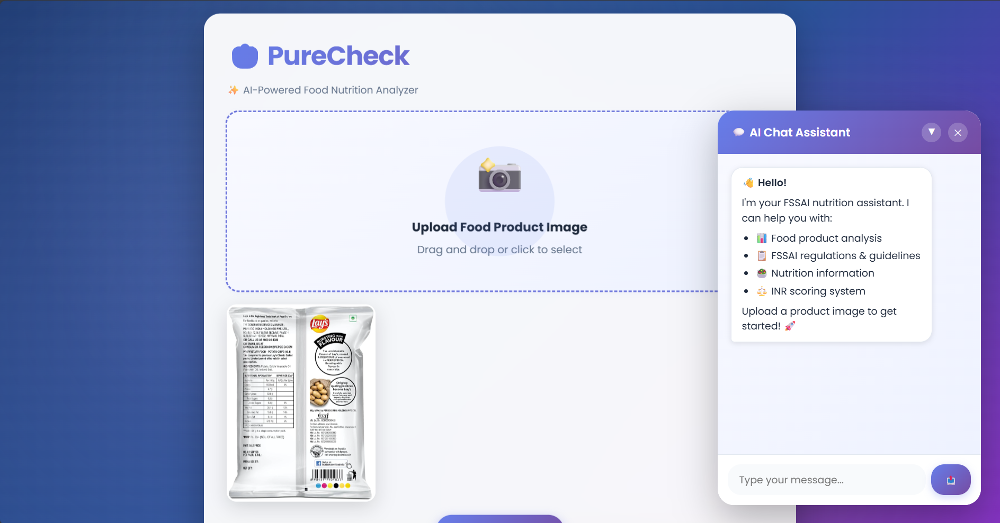

# 🍎 PureCheck

> AI-Powered Food Product Nutrition Analyzer with Indian Nutrition Rating (INR)



## 📖 Overview

**PureCheck** is an intelligent web application that analyzes food product images and provides comprehensive nutritional insights based on FSSAI (Food Safety and Standards Authority of India) guidelines. Upload a food product image, and get instant nutrition analysis, health warnings, and an Indian Nutrition Rating (INR) score.

## ✨ Key Features

- 🖼️ **Image Upload & Analysis** - Drag-and-drop or select food product images for instant AI analysis
- 🤖 **GPT-4o Vision** - Automatically extracts nutritional information from product labels
- 🧠 **o3-mini Reasoning** - Advanced reasoning model calculates health scores and provides insights
- 📊 **INR Score** - Get an A-E grade based on FSSAI nutritional guidelines
- 💬 **AI Chat Assistant** - Ask questions about your uploaded products or FSSAI regulations
- 🔍 **RAG-Powered Q&A** - Retrieval-Augmented Generation for accurate FSSAI guideline answers
- ⚠️ **Health Warnings** - Instant alerts for high sugar, fat, sodium, and other concerns
- ✅ **Positive Claims** - Highlights beneficial nutrients like protein and fiber

## 🎯 Use Cases

- **Health-conscious consumers** - Make informed food choices
- **Dietitians & nutritionists** - Quick product assessment
- **Parents** - Verify children's snack nutrition
- **Fitness enthusiasts** - Track macronutrient intake
- **Food researchers** - Analyze product compliance with FSSAI standards

## 🛠️ Technology Stack

- **Backend**: Flask (Python)
- **AI Models**: 
  - GPT-4o (Vision & Chat)
  - o3-mini (Reasoning & Analysis)
  - text-embedding-ada-002 (Embeddings)
- **LangChain**: RAG pipeline, document retrieval, and chain orchestration
- **Vector Database**: Pinecone (FSSAI guideline storage)
- **Frontend**: HTML, CSS, JavaScript (Vanilla)
- **Cloud**: Azure OpenAI Services

## 📸 Screenshots


*Main interface showing nutrition analysis and chat*

## 🚀 Quick Start

### Prerequisites

- Python 3.8+
- Azure OpenAI API access
- Pinecone account

### Installation

1. **Clone the repository**
   ```bash
   git clone https://github.com/Abhishek28042001/PureCheck.git
   cd PureCheck
   ```

2. **Install dependencies**
   ```bash
   pip install -r requirements.txt
   ```

3. **Set up environment variables**
   
   Create a `.env` file in the root directory:
   ```env
   NETAICONNECT_API_KEY=your_azure_openai_api_key
   PINECONE_API_KEY=your_pinecone_api_key
   ```

4. **Initialize the vector store** (one-time setup)
   ```bash
   python store_index.py
   ```

5. **Run the application**
   ```bash
   python app.py
   ```

6. **Open in browser**
   ```
   http://localhost:5000
   ```

## 📋 How It Works

### 1. **Image Upload**
- User uploads a food product image
- Image is validated and saved securely

### 2. **Nutrition Extraction**
- GPT-4o Vision analyzes the product label
- Extracts: energy, fats, carbs, protein, sodium, fiber, etc.

### 3. **INR Calculation**
- o3-mini reasoning model compares nutrients against FSSAI baselines
- Calculates positive and negative factors
- Assigns A-E grade based on nutritional quality

### 4. **Analysis Display**
- Shows INR score with color-coded grade
- Lists health warnings (high sugar, fat, sodium)
- Highlights positive nutrients (protein, fiber)
- Provides per-serving nutritional breakdown

### 5. **Chat Interaction**
- Ask product-specific questions
- Query FSSAI guidelines via RAG
- Get personalized health recommendations

## 🔧 Configuration

### FSSAI INR Baseline (per day)

```python
FSSAI_INR_BASELINE = {
    "energy_kcal": 2000,
    "total_fat_g": 65,
    "saturated_fat_g": 20,
    "carbohydrates_g": 300,
    "sugars_g": 50,
    "added_sugars_g": 30,
    "protein_g": 50,
    "sodium_mg": 2000,
    "fiber_g": 25,
}
```

### Supported Image Formats
- PNG, JPG, JPEG, GIF, WEBP
- Max file size: 16MB

## 📂 Project Structure

```
PureCheck/
├── app.py                      # Main Flask application
├── store_index.py              # Vector store initialization
├── requirements.txt            # Python dependencies
├── setup.py                    # Package setup
├── .env                        # Environment variables (create this)
├── data/                       # FSSAI documents (PDF storage)
├── images/                     # Project images/screenshots
├── src/
│   ├── __init__.py
│   ├── helper.py              # Utility functions
│   └── prompt.py              # Prompt templates
├── templates/
│   └── index.html             # Frontend UI
└── uploads/                   # Uploaded product images
```

## 💡 Example Usage

### Chat Examples

**Product Questions:**
- "Is this product healthy?"
- "What does high saturated fat mean?"
- "Can I consume this daily?"
- "What are the main health concerns?"

**FSSAI Questions:**
- "What are FSSAI guidelines for sodium?"
- "What is the recommended daily sugar intake?"
- "What foods should children avoid?"

## 🔐 Environment Variables

| Variable | Description | Required |
|----------|-------------|----------|
| `NETAICONNECT_API_KEY` | Azure OpenAI API key | ✅ Yes |
| `PINECONE_API_KEY` | Pinecone vector DB API key | ✅ Yes |

## 🤝 Contributing

Contributions are welcome! Please feel free to submit a Pull Request.

1. Fork the repository
2. Create your feature branch (`git checkout -b feature/AmazingFeature`)
3. Commit your changes (`git commit -m 'Add some AmazingFeature'`)
4. Push to the branch (`git push origin feature/AmazingFeature`)
5. Open a Pull Request

## 📄 License

This project is licensed under the Apache License 2.0 - see the [LICENSE](LICENSE) file for details.

## 👨‍💻 Author

**Abhishek Kumar**
- GitHub: [@Abhishek28042001](https://github.com/Abhishek28042001)

## 🙏 Acknowledgments

- FSSAI for nutrition guidelines
- Azure OpenAI for powerful AI models
- LangChain for RAG framework
- Pinecone for vector storage

---

**Made with ❤️ for healthier food choices in India**
